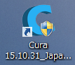
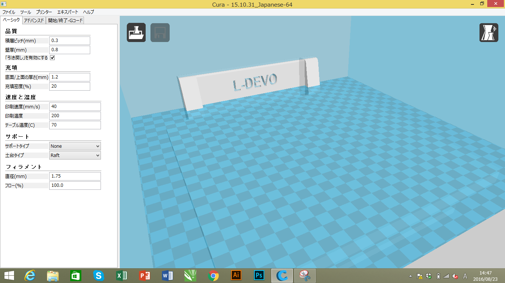
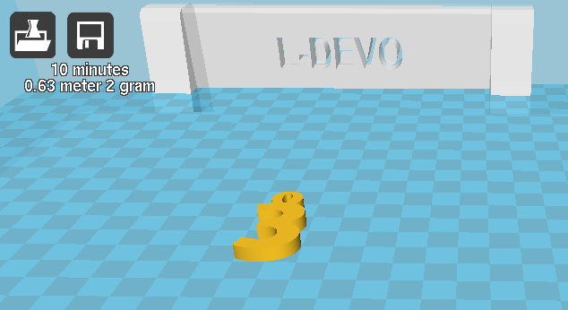

# 01.Curaへのデータ読み込み
 

（※3Dプリンタ制御用ソフト**[Cura](https://ultimaker.com/ja/software/ultimaker-cura)**を使用します。） 
 
 
 

 
 

デスクトップのCuraアイコンをダブルクリックし、ソフトを立ち上げます。 
 
 
 

 
 

ソフトが無事立ち上がると上記のようなウィンドウが表示されます。 
 
 
 

 
 

画面左上のロードアイコンをクリックします。 
 
 
 

 
 

プリントしたいSTLもしくはOBJファイルを選択します。 
結果のないファイルであれば、上記のようにウィンドウ上にモデルが配置され、 
左上のSaveアイコンの下に、現在の設定でプリントした場合の予測プリント時間とフィラメント使用量が表示されます。 
 
 
 
 
 
 
