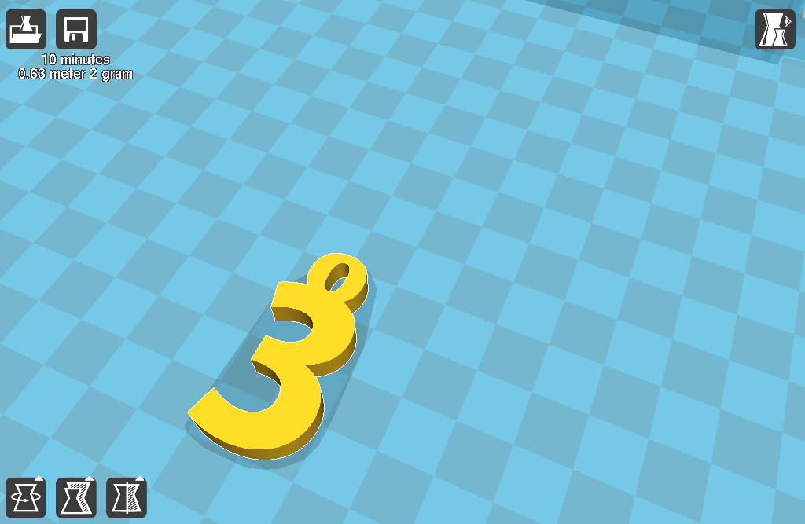
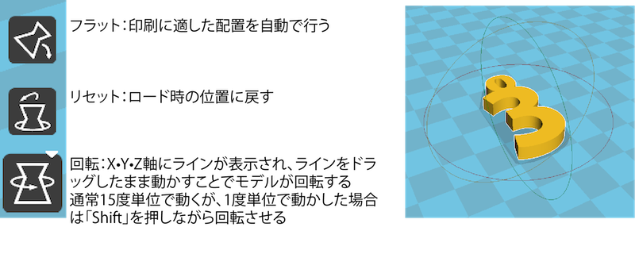
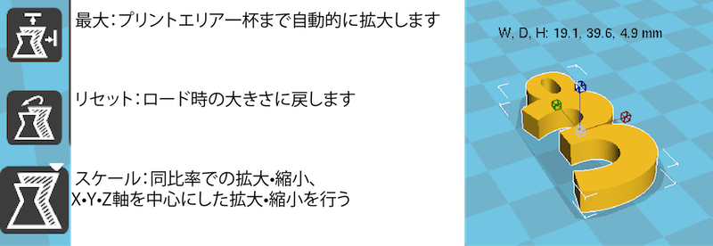
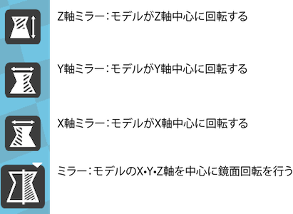

# 02.モデルの配置
 

（※3Dプリンタ制御用ソフト**[Cura](https://ultimaker.com/ja/software/ultimaker-cura)**を使用します。） 
 

モデルを読み込みクリックすると表示されるアイコンで、プリントする位置やサイズなどを調整します。 
位置調整時には以下のような点に注意しましょう。 

* なるべくマスキングテープが摩耗していない場所でプリントする。
* Cura中で拡大•縮小は行えるが、なるべくモデリング時に大きさは調整しておく。
* モデルはなるべくサポートがつかない方向でプリントする。（理想的にはサポート•ラフトは無いほうが良い）

 
 
 

 
 

この時モデルをドラッグすることで、プリントする場所を移動することができます。 
 
 
 

 
 

左下の回転アイコンをクリックすることでモデルを回転させることができます。 
 
 
 

 
 

左下のスケーリングアイコンをクリックすることでモデルを拡大•縮小させることができます。 
 
 
 

 
 

左下のミラーアイコンをクリックすることでモデルを鏡面回転させることができます。 
 
 
 
 
 
 
