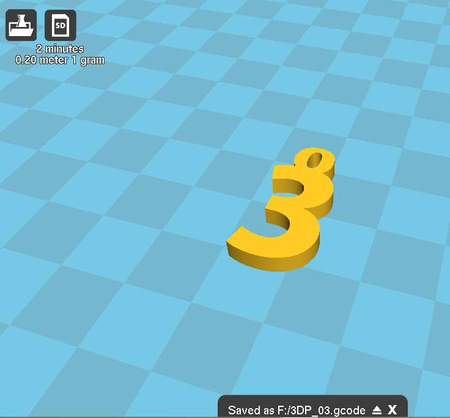

# 03.プリント設定〜gcode書き出し
 

（※3Dプリンタ制御用ソフト**[Cura](https://ultimaker.com/ja/software/ultimaker-cura)**を使用します。） 
 

 
 

Curaの画面左の**ベーシック**設定をチェックします。 
基本的には上記の設定が推奨ですが、モデル形状やフィラメントによっては変更する必要があります。 

* **積層ピッチ：**毎積層毎の高さ。0.1〜0.3mmの間で設定可能。薄いほうがなめらかに仕上がるがその分時間もかかります。
* **壁厚：**造形物の壁面の厚さ
* **「引き戻し」を有効にする：**印刷しない時にフィラメントを引き戻し、余計な素材が付着しないようにします。
* **底面\/上面の厚さ：**造形物の底面、上面の厚さ
* **充填密度：**造形物内部を内部の詰り具合。形だけ見るなら低密度で良いが、強度が必要なら密度を上げる必要があります。
* **印刷速度：**プリント時間を短縮するなら速度を上げる必要がありますが、一般的に低速のほうがキレイに仕上がります。
* **印刷温度：**PLAをプリントする場合は大体190〜200℃に設定。
* **テーブル温度：**PLAの場合は70℃に設定。0℃でも問題ありません。
* **サポートタイプ：**
  * **None：**サポート無し
  * **Touching Builplate：**モデルの外部（ベッドに接する部分）のみにサポートをつけます。
  * **Everywhere：**必要な面全てにサポートを付けます。
* **土台タイプ：**
  * **None：**底面に何もつけず、モデルをそのまま造形します。
  * **Brim：**底面には何もつかないが、周りに薄いつばを作成しモデルを造形します。
  * **Raft：**モデル底面に厚みのある「土台」を作成してからモデルを造形します。
* **直径：**使用するフィラメント径（変更の必要なし、L-DEVOなら1.75mm固定）
* **フロー：**マテリアルの射出量を調整（変更の必要なし。100のままでOK。）

 
 
 

  
 

プリント設定が完了したら、データをSDカードに保存しプリンタに移します。 
まず、3DプリンタのSDカードを抜き出し、PCに差しこみます。 
 
 
 

 
 

Curaのセーブアイコンが、フロッピーマークからSDマークに変わるのでこれをクリックします。 
 
 
 

 

 
 

3Dプリンタ用データ"gcode"ファイルがSDカードに保存されたのを確認してから、 
画面下に現れるメッセージ部分の「取り出し」アイコンをクリックし、 
SDをPCから抜き取って再度3Dプリンタに差し込みます。
 
 
 
 
 
 
