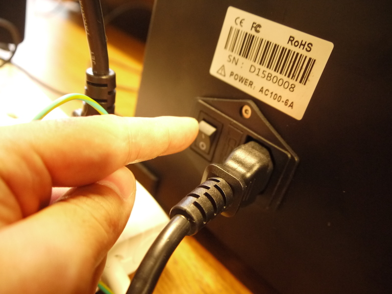
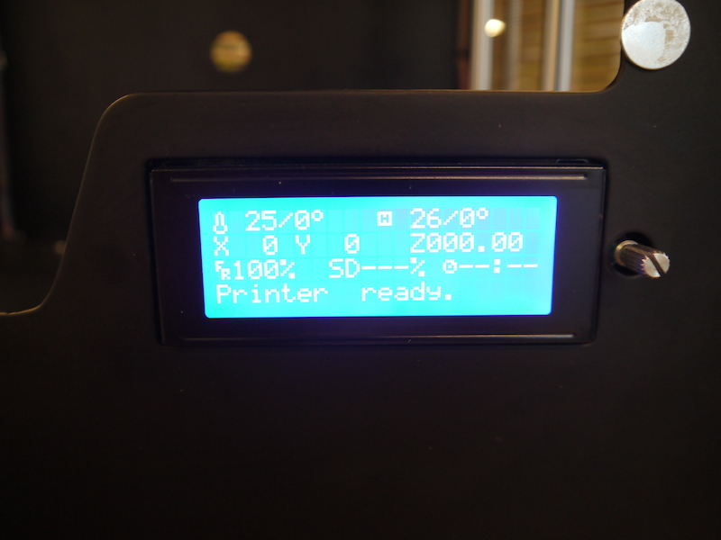
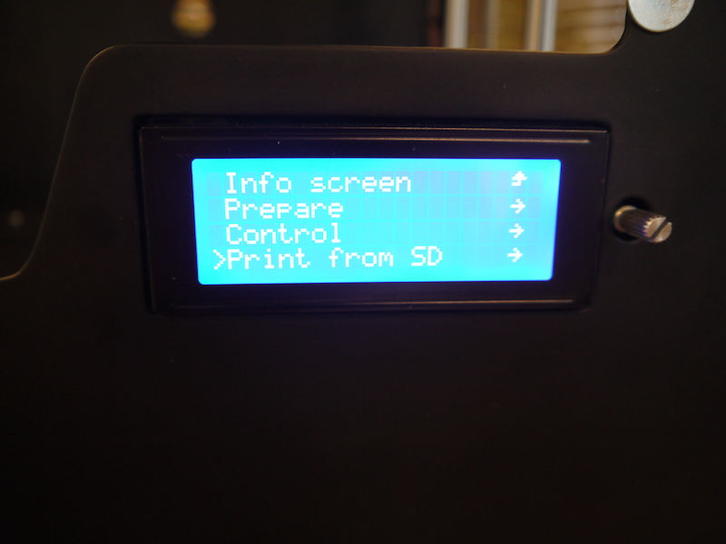
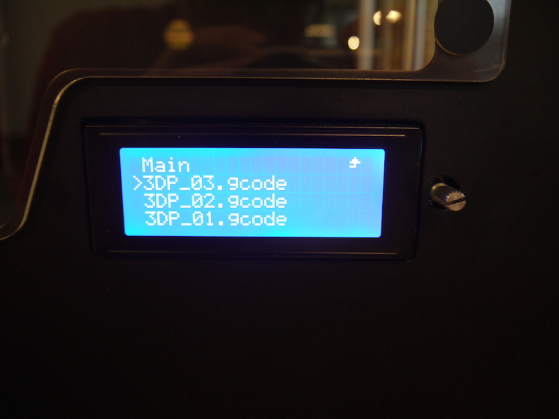
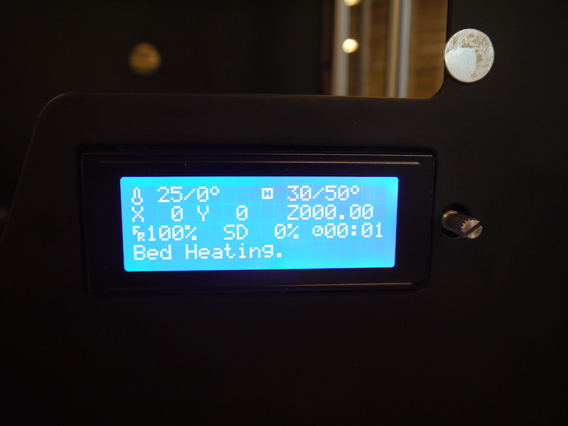
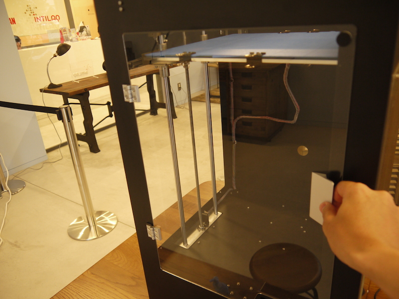

# 04.プリンタ起動〜プリント
  

 
 

3Dプリンタ背面の電源スイッチを押し、本体の電源を入れます。 
 
 
 

 
 

プリンタに電源が入ると正面のLCDディスプレイに文字が表示されます。 
 
 
 

 
 

ディスプレイ横の銀色のノブを1回押すと、ディスプレイの内容が以下のように変化します。 
ノブを回すことでメニューが選択できるので、**「Print from SD」**にカーソルを合わせ、ノブをクリックします。 
（もし間違えたら「↑」を選択することで一画面前に戻ることが出来ます。） 
 
 
 

 
 

SDカードに保存されたgcodeの一覧が表示されるので、 
ノブを回してプリントしたいgcodeを選択し、クリックすればプリントが始まります。 
 
 
 

 
 

プリント中は上記のようなディスプレイ表示になり、この時ノブを回せば印刷速度をリアルタイムに変更可能です。 
プリントを中断したい時はノブを押し、メニューから「Stop Print」を選択すればプリンタが完全に停止します。 
（プリントの再開はできません。） 
 
 
 

 
 

プリントが始まったらマシンの扉を閉めておきます。 
1層目が一番大切なので、しっかりプリントベッドにフィラメントが食いついているか確認してください。 
プリントが終了すると、ノズルが自動的にホームポジションに戻ります。 
 
 
 
 
 
 
