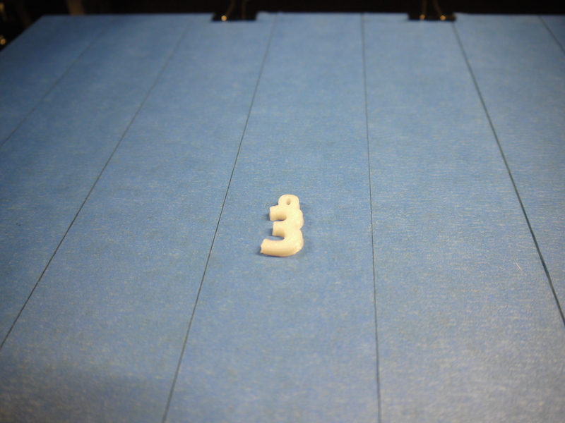
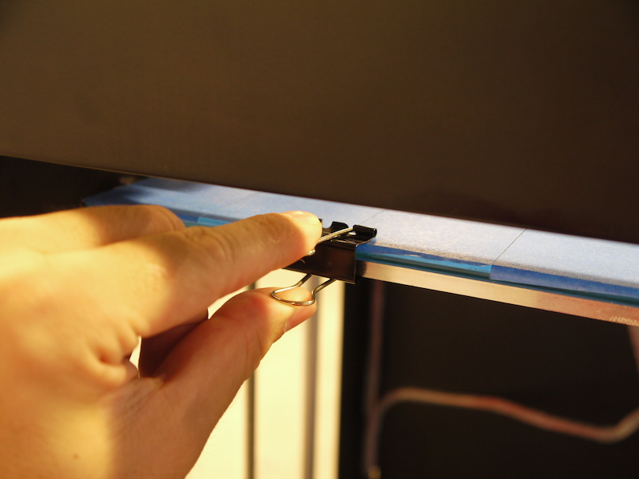
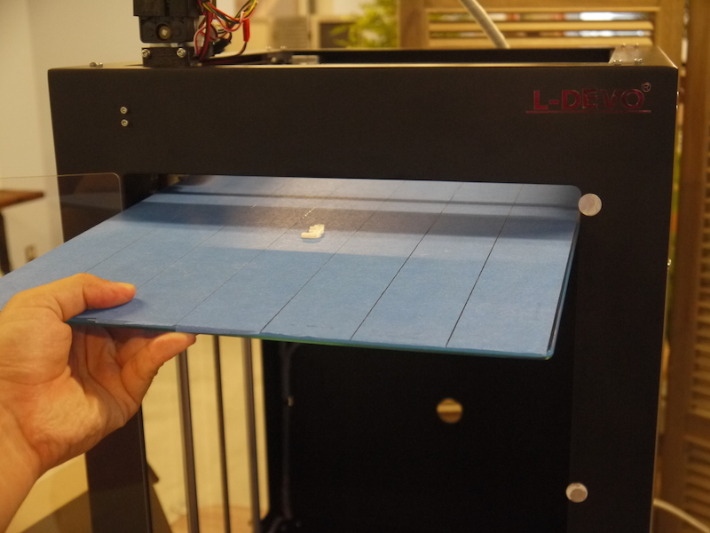
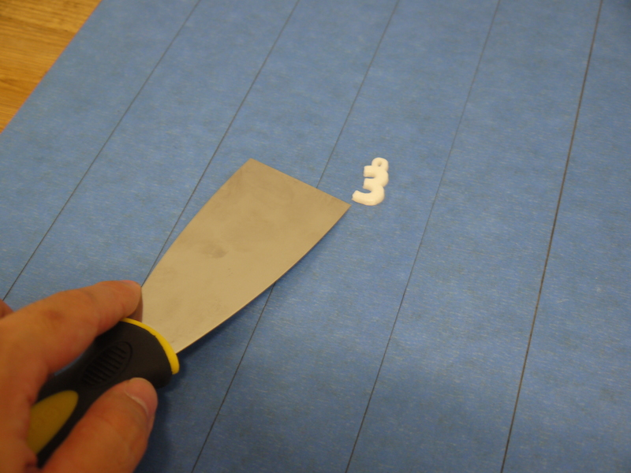
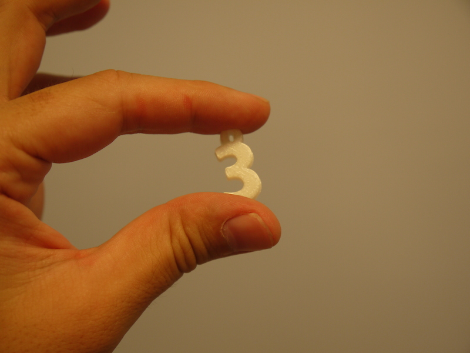

# 05.造形物の取り外し
  

 
 

プリントが完了したら、造形物をプリンティングベッドから取り外します。 
このときベッドが高温になっている可能性があるので注意してください。 
 
 
 

 
 

まず、プレートの四角についているクリップを外します。 
 
 
 

 
 

プリンティングベッドを3Dプリンタから引き出します。（プレートはガラス製なので取扱注意！） 
 
 

 
 

安定した机または台の上にプレートを置き、スクレーパー等を使って造形物をプレートからはがします。 
勢い良くスクレーパーを当てるのではなく、スクレーパーの角を造形物の底面にグッと潜り込ませ、 
じわじわと引き剥がしていくのがコツです。 
また、プレートが熱いうちにモデルを動かすとゆがみの原因になるので、 
精度を出したい場合は、プレートが冷めてからモデルを引き剥がしてください。 
 
 
 

 
 

造形物をはがすことができたらプリンティングベッドを3Dプリンタに戻し、クリップを取り付けて固定します。 
 
 
 
 
 
 
